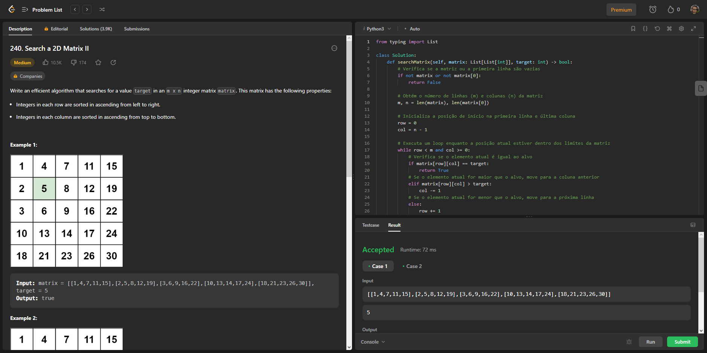
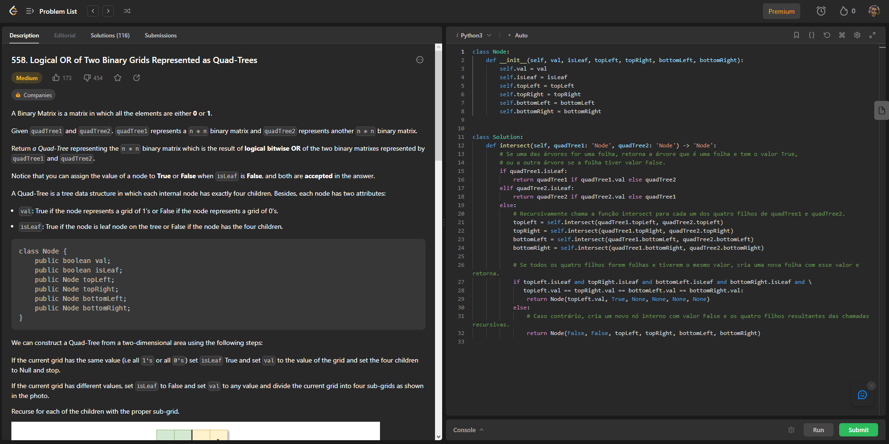
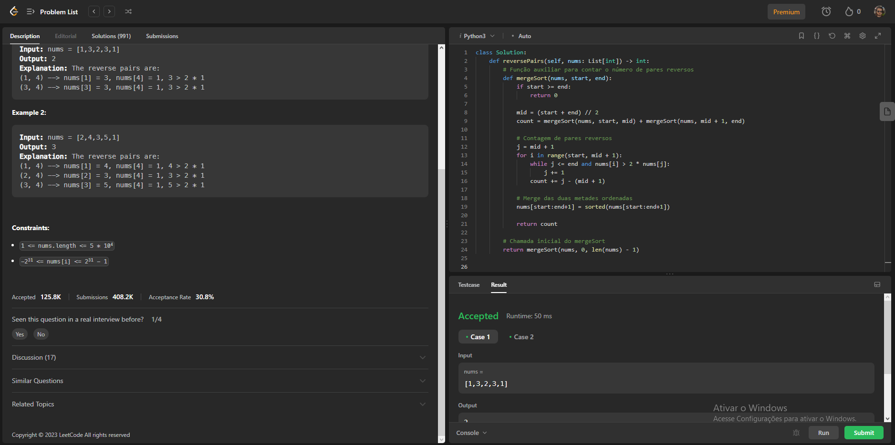
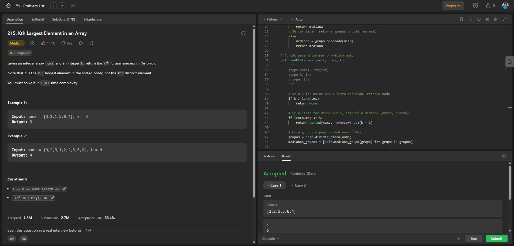
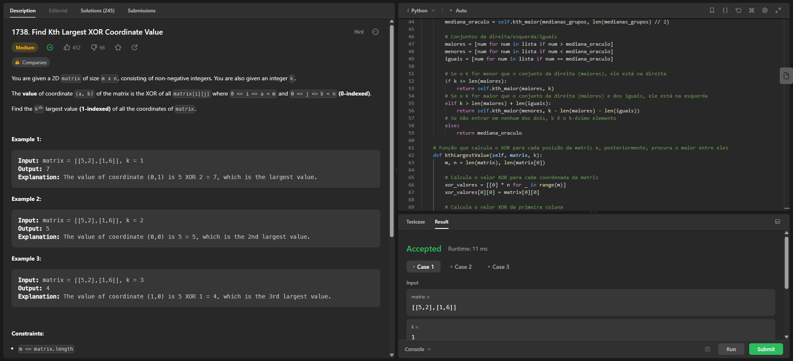

# Dividir e Conquistar - Exercicios Diversos (Leet Code)

**Número da Lista**: 25 (turma 2) 
**Conteúdo da Disciplina**: Divide and Conquer 

## Alunos
|Matrícula | Aluno |
| -- | -- |
| 20/0028472  |  Vinícius Assumpção de Araújo T01 |
| 20/0028367  |  Victor Hugo Oliveira Leão T02 |

## Sobre 
Este projeto se trata da resolução de 6 exercícios (4 médios e 2 difíceis pela classificação do site Leet Code) abordando o tema de algoritimos dividir e conquistar. Os exercícios foram retirados do site [LeetCode](https://leetcode.com).

## Screenshots

### Exercicio 1 (Médio) - [Search a 2D Matrix II](https://leetcode.com/problems/search-a-2d-matrix-ii/)
**Código:** [ACESSO](Search2DMatrix/Search2DMatrix.py) 

### Exercicio 2 (Médio) - [Logical OR of Two Binary Grids Represented as Quad-Trees](https://leetcode.com/problems/logical-or-of-two-binary-grids-represented-as-quad-trees/)
**Código:** [ACESSO](LogicalQuad/Logical.py) 

### Exercicio 3 (Díficil) - [Reverse Pairs](https://leetcode.com/problems/reverse-pairs/)
**Código:** [ACESSO](ReversePairs/Reverse.py) 

### Exercicio 4 (Médio) - [Kth Largest Element in an Array](https://leetcode.com/problems/kth-largest-element-in-an-array/)
**Código:** [ACESSO](KthElement/KthElement.py) 

### Exercicio 5 (Médio) - [Find Kth Largest XOR Coordinate Value](https://leetcode.com/problems/find-kth-largest-xor-coordinate-value/)
**Código:** [ACESSO](KthXOR/KthXOR.py) 

### Exercicio 6 (Díficil) - [Median of Two Sorted Arrays](https://leetcode.com/problems/median-of-two-sorted-arrays/)
**Código:** [ACESSO](MedianArrays/MedianArrays.py) 

## Vídeo

## Instalação 
**Linguagem**: Python 
**Framework**: (caso exista) 
Pré-requisitos : Apenas o python3 instalado, caso o avaliador queira rodar localmente os códigos, no entanto isso pode ser feito também pelo próprio site da LeetCode, bastanto ter uma conta. 

## Uso 

### Passo 1: Copiar o código
Entre na pasta do exercício específico, clique no arquivo `.py` do código de interesse e copie-o.

### Passo 2: Entrar na página do exercício
Entre na página LeetCode do exercício específico para que o código seja executado. O link para a página pode ser encontrado neste README na sessão "Sobre".

### Passo 3: Alterar linguagem
Altere a linguagem utilizada como resolução para `Python3` (a opção fica logo acima do editor de código).

### Passo 4: Colar o código
Ainda na página do LeetCode, cole o código copiado no editor de código.

### Passo 5: Rodar o código
Abaixo do editor de código, clique em `Run` para executar o código.

### Passo 6: Verificar resultados
Assim que executado, verifique os resultados e se o código resolve o exercício.

